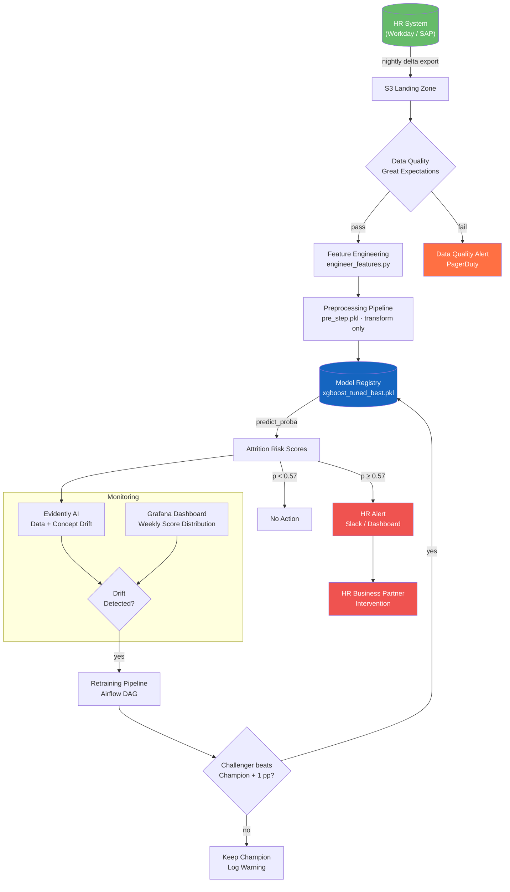

# Employee Churn Prediction System

End-to-end ML pipeline for predicting employee attrition using the IBM HR Analytics dataset. Covers EDA, feature engineering, model training & selection, SHAP explainability, productization plan, and A/B test design.

---

## Project Structure

```
Employee-Churn-Prediction-System/
├── notebook.ipynb          # Full analysis (8 sections, ~85 cells)
├── requirements.txt        # Pinned Python dependencies
├── README.md               # This file
├── executive_summary.md    # Half-page business summary
├── ab_test_plan.md         # A/B test design document
├── production_pipeline.md  # Detailed production pipeline specification
└── models/                 # Saved model artefacts (created at runtime)
    ├── logistic_regression_v<timestamp>.pkl
    ├── random_forest_v<timestamp>.pkl
    ├── xgboost_v<timestamp>.pkl
    └── svm_v<timestamp>.pkl
```

---

## Quick Start

### 1. Install dependencies

```bash
python -m venv venv
source venv/bin/activate          # Windows: venv\Scripts\activate
pip install -r requirements.txt
```

### 2. Run the notebook

```bash
jupyter notebook notebook.ipynb
```

Run all cells top-to-bottom (**Kernel → Restart & Run All**).  
The dataset is downloaded automatically from GitHub on first execution.

> **Note:** Section 5 Optuna tuning runs 40 trials (~2–3 min on a modern laptop). Section 6 SHAP computation takes ~30 s.

---

## Key Results

### Baseline models (validation set)

| Model | ROC-AUC | Recall | F1 | PR-AUC |
|---|---|---|---|---|
| Logistic Regression | 0.815 | 0.806 | 0.513 | 0.596 |
| XGBoost | 0.788 | 0.528 | 0.521 | 0.572 |
| SVM | 0.770 | 0.389 | 0.483 | 0.508 |
| Random Forest | 0.771 | 0.167 | 0.273 | 0.501 |

### After Optuna hyperparameter tuning

| Model | ROC-AUC | Recall | F1 | PR-AUC |
|---|---|---|---|---|
| **XGBoost (tuned)** | **0.859** | **0.694** | **0.544** | **0.709** |
| Logistic Regression (tuned) | 0.849 | 0.750 | 0.643 | 0.670 |

**Champion model:** XGBoost (tuned) — highest ROC-AUC and PR-AUC.

**Optimal threshold:** 0.57 (F2-optimal, prioritises recall in the high-FN-cost HR context)

### Top attrition drivers (permutation importance)

| Rank | Feature | Importance |
|---|---|---|
| 1 | OverTime | 0.058 |
| 2 | BusinessTravel | 0.035 |
| 3 | NumCompaniesWorked | 0.029 |
| 4 | YearsSinceLastPromotion | 0.027 |
| 5 | JobInvolvement | 0.016 |

---

## Production Architecture



---

## Notebook Sections

| # | Section | Key Content |
|---|---|---|
| 1 | EDA & Preprocessing | Missing values, outliers (IQR + Z-score), 5 EDA visualizations, statistical analysis by class |
| 2 | Feature Engineering | 6 engineered features, data-leakage explanation |
| 3 | Transformations | StandardScaler, OHE, sklearn Pipeline, leakage-of-scaling discussion |
| 4 | Model Training | 4 models (LR, RF, XGBoost, SVM), SMOTE + class_weight, joblib versioning |
| 5 | Validation & Selection | 70/15/15 split, 5-fold CV, learning curves, all metrics, Optuna tuning (40 trials), threshold optimisation |
| 6 | Feature Importance | SHAP global/local, waterfall plots for 3 risk profiles, dependence plots, permutation importance, point-biserial |
| 7 | Visualizations | Confusion matrix, ROC, PR curves, feature importance bar, SHAP beeswarm, calibration curve |
| 8 | Productization Plan | Architecture, data pipeline, monitoring (PSI, drift), retraining strategy |

---

## Deliverables Checklist

- [x] `notebook.ipynb` — full Jupyter notebook (8 sections)
- [x] `requirements.txt` — pinned dependencies
- [x] `README.md` — project structure, run instructions, key results, Mermaid architecture diagram
- [x] `executive_summary.md` — business summary
- [x] `ab_test_plan.md` — A/B test design (hypotheses, sample size, ethics, quasi-experimental alternatives)
- [x] `production_pipeline.md` — detailed production pipeline specification

---

## Environment

Tested with Python 3.10. Primary dependencies: `pandas 2.1`, `scikit-learn 1.4`, `imbalanced-learn 0.12`, `xgboost 3.2`, `shap 0.42`, `optuna 3.5`, `ipywidgets 8+`.
