# Production Pipeline — Employee Churn Prediction System

```mermaid
flowchart TD
    %% ── Data Sources ──────────────────────────────────────────
    A[(HR System<br/>HRIS / SQL)] -->|Daily extract| B
    A -->|"Employee left → label=1 immediately<br/>90 days passed + still employed → label=0"| LHT

    %% ── Data Stores ───────────────────────────────────────────
    subgraph STORES["⓪ Data Stores"]
        AEP[("🟢 Active Employee Pool<br/>Current employees · no labels<br/>Updated daily")]
        LHT[("🗄️ Labeled History Table<br/>Past employees · confirmed labels<br/>Updated daily")]
    end

    A -->|"Daily snapshot<br/>of active employees"| AEP

    %% ── Ingestion & Validation ────────────────────────────────
    subgraph INGEST["① Ingestion & Validation"]
        B[Schema Validator<br/>check columns · dtypes · ranges]
    end

    AEP -->|Scoring input| B
    B -->|Pass| C
    B -->|Fail| ERR1["🚨 Schema Alert<br/>Slack / Email<br/>Pipeline halted"]

    %% ── Preprocessing ─────────────────────────────────────────
    subgraph PREP["② Preprocessing Pipeline  (joblib)"]
        C[encode_ordinal_columns] --> D[Engineer 6 Features<br/>Tenure_Ratio · OverTime · etc.]
        D --> E[ColumnTransformer<br/>StandardScaler + OneHotEncoder]
    end

    %% ── Model ─────────────────────────────────────────────────
    E --> F

    subgraph MODEL["③ Model"]
        F["🏆 LR Tuned<br/>(Champion · MLflow Registry)"]
    end

    F --> G["Risk Scores<br/>P(leave) per employee"]

    %% ── Serving ───────────────────────────────────────────────
    subgraph SERVE["④ Serving"]
        G --> H["REST API<br/>FastAPI — real-time<br/>Single employee query"]
        G --> I["Batch Job<br/>Airflow — daily<br/>Full workforce scoring"]
    end

    H --> DASH
    I --> DASH

    DASH["📊 HR Dashboard<br/>Risk rankings · Flagged employees"]

    %% ── Monitoring ────────────────────────────────────────────
    subgraph MONITOR["⑤ Monitoring"]
        G --> M1["Data Drift<br/>KS test · PSI<br/>nightly on top-10 features"]
        DASH --> M2["Performance Monitor<br/>Recall · PR-AUC<br/>90-day label lag"]
        M1 & M2 --> ALERT["Alerting Engine"]
    end

    ALERT -->|"Drift PSI > 0.2 / Recall < 0.65"| RETRAIN

    %% ── Retraining ────────────────────────────────────────────
    subgraph RETRAIN["⑥ Retraining"]
        LHT -->|"Full history or<br/>rolling window"| R1
        R1["Build Training Dataset<br/>≥ 500 new labeled samples"]
        R1 --> R2["Train Challenger<br/>RandomizedSearchCV · F2 scoring"]
        R2 --> R3{"Champion vs Challenger<br/>Time-aware holdout<br/>last 3 months"}
        R3 -->|"Challenger wins<br/>PR-AUC +0.02 · Recall ≥ baseline"| R4["Promote to Production<br/>MLflow Registry"]
        R3 -->|"Champion wins"| R5["Keep Champion<br/>Log & investigate"]
    end

    R4 -->|"New Champion"| F

    %% ── Styling ───────────────────────────────────────────────
    classDef source   fill:#E3F2FD,stroke:#1565C0,color:#000
    classDef store    fill:#FFF3E0,stroke:#E65100,color:#000
    classDef process  fill:#F3E5F5,stroke:#6A1B9A,color:#000
    classDef model    fill:#E8F5E9,stroke:#2E7D32,color:#000,font-weight:bold
    classDef serving  fill:#FFF8E1,stroke:#F57F17,color:#000
    classDef monitor  fill:#FBE9E7,stroke:#BF360C,color:#000
    classDef retrain  fill:#E0F2F1,stroke:#00695C,color:#000
    classDef alert    fill:#FFEBEE,stroke:#C62828,color:#000

    class A source
    class AEP,LHT store
    class B,C,D,E process
    class F,R4 model
    class H,I,DASH serving
    class M1,M2,ALERT monitor
    class R1,R2,R3,R4,R5 retrain
    class ERR1 alert
```

## Layer Summary

| # | Layer | Technology | Trigger |
|---|---|---|---|
| ⓪ | Data Stores | Active Employee Pool + Labeled History Table | Both updated daily — label=1 on departure, label=0 after 90-day window closes |
| ① | Ingestion & Validation | SQL extract + schema checks | Daily 02:00 |
| ② | Preprocessing | `joblib` Pipeline (sklearn) | On each batch / API call |
| ③ | Model | Logistic Regression (tuned) via MLflow Champion | On each preprocessed input |
| ④ | Serving | FastAPI (real-time) + Airflow (batch) | API: on-demand · Batch: daily |
| ⑤ | Monitoring | KS test, PSI, PR-AUC tracking | Nightly drift · 90-day label lag |
| ⑥ | Retraining | Labeled History Table → RandomizedSearchCV → Champion/Challenger | Triggered by alert |
